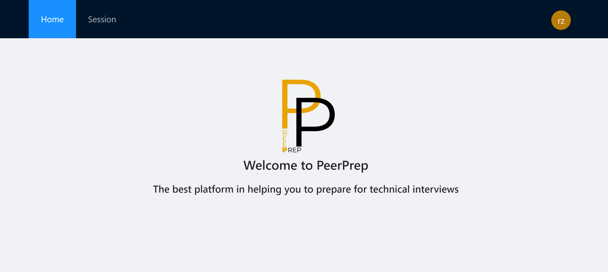

# PeerPrep Frontend

This project was bootstrapped with [Create React App](https://github.com/facebook/create-react-app).

# Set Up Guide

## Navigate to the `frontend/app` directory

Run `cd frontend/app` from the root of the project.

## Installing Dependencies

Run `npm install` to install dependencies

## Running Locally

1. After installing dependencies, run `npm start` to start the application.
2. The application should be started on http://localhost:3000.